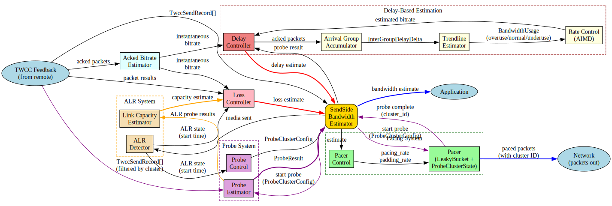

# Bandwidth Estimation (BWE)

str0m implements Google Congestion Control (GCC) bandwidth estimation
based on Transport-Wide Congestion Control (TWCC) feedback. This document
describes the architecture, components, and implementation details of the
BWE system.

### WebRTC revision

This git revision we have aligned the str0m impl to.

**Revision**: 2bc24d44be71c186ee0756725abaed7015fbc8bc

**Date**: Sat Jan 10 00:02:32 2026 -0800

## How It Works: High-Level Overview

Bandwidth estimation continuously measures how much data you can send
without causing network congestion. It combines three complementary
detection methods:

### Delay-Based Detection (Primary)

Monitors packet arrival timing. When packets arrive later than expected
(queuing delay increasing), the network is congested and we reduce sending
rate. This is the **primary** congestion signal, running continuously on
every TWCC feedback report.

### Loss-Based Detection (Safety Net)

Tracks packet loss. When packets are being dropped, the network is
severely congested. This acts as a **safety cap** on the delay-based
estimate, only reducing the estimate when loss exceeds the link's inherent
loss rate. It prevents over-estimation when delay signals are unclear.

### Probe-Based Discovery (Active Measurement)

Periodically sends bursts of packets at higher rates to test if more
bandwidth is available. Probes provide **ground truth** measurements that
help the system ramp up quickly when conditions improve. They're used:
- At startup to quickly find initial capacity
- When the estimate increases significantly (validating the growth)
- When application demand exceeds current estimate (exploring headroom)
- During ALR to rediscover capacity

### Application Limited Region (ALR)

ALR occurs when your application sends **less than 65% of available
capacity** – for example, during silence suppression in audio, or when
video is paused. This is important because:

1. **Loss patterns differ**: During normal operation, loss indicates
   congestion. During ALR, loss could be unrelated to your sending rate
   since you're barely using the network. Without ALR awareness, the loss
   controller might incorrectly reduce estimates based on irrelevant loss.

2. **Capacity discovery**: When operating in ALR, we don't know the true
   network capacity because we're not pushing against it. The ALR detector
   tracks this state and provides it to probe control and loss controller
   for appropriate behavior.

3. **Accurate bounds**: Successful ALR probes provide proven capacity
   measurements. The loss controller uses these as upper bounds during
   ALR, preventing it from estimating beyond what we've actually
   demonstrated the network can handle.

Without ALR integration, the BWE system treats application-limited
scenarios the same as network-limited ones, leading to incorrect estimates
and slower adaptation when application demand resumes.

## Signal Flow Diagram

**Signal Types:**
- 🔴 **Red (thick)**: Core BWE estimates (delay-based, loss-based)
- 🔵 **Blue (thick)**: Application/Network output (final estimate, packet
  transmission)
- 🟣 **Purple**: Probe measurements (ALR probe results)
- 🟠 **Orange (thick)**: ALR capacity constraint (proven capacity bound)
- ⚫ **Black**: Internal/control signals (TWCC feedback, configuration)

## Component Overview

### SendSideBandwidthEstimator

**Location:** `src/bwe/mod.rs`
**WebRTC:** `modules/congestion_controller/goog_cc/send_side_bandwidth_estimation.cc`

The main orchestrator that coordinates all BWE components. It receives
TWCC feedback reports and produces bandwidth estimates by merging inputs
from the delay controller, loss controller, and probe system. When TWCC
feedback arrives, it forwards the acknowledged packets to both the delay
and loss controllers, then combines their estimates to produce a final
bandwidth estimate. This estimate is emitted to the application as an
`Event::EgressBitrateEstimate` event and flows to the pacer control to
adjust pacing and padding rates.

The estimator also manages the probe lifecycle, creating probe cluster
configurations via `maybe_create_probe()` when bandwidth discovery is
needed, and tracking when probes complete. It monitors for overuse
conditions via `is_overusing()` which influences both probe scheduling and
pacer behavior. Throughout operation, it tracks ALR (Application Limited
Region) state by forwarding information to probe control and loss
controller.

### Delay Controller

**Location:** `src/bwe/delay/control.rs`
**WebRTC:** `modules/congestion_controller/goog_cc/delay_based_bwe.cc`

Implements delay-based bandwidth estimation by analyzing packet arrival
time variations. This is the primary congestion detection mechanism.

**How it works:**
1. Groups packets into arrival groups (via `ArrivalGroupAccumulator`)
2. Calculates inter-group delay variations
3. Feeds delay variations to trendline estimator
4. Maintains smoothed RTT using EWMA with α = 1/8 (RFC 6298), matching
   WebRTC's approach where each controller calculates its own smoothed RTT
   rather than relying on externally-provided values
5. Uses rate control (AIMD) to adjust bandwidth estimate at regular
   intervals (`UPDATE_INTERVAL` = 25ms)
6. Invalidates the trendline hypothesis if no TWCC feedback received for
   more than 2× smoothed RTT (capped at `MAX_TWCC_GAP` = 500ms)

The controller produces a delay-based bandwidth estimate along with an
overuse state signal, both of which flow to the SendSideBandwidthEstimator
for final bandwidth determination.

### Arrival Group Accumulator

**Location:** `src/bwe/delay/arrival_group.rs`
**WebRTC:** `modules/remote_bitrate_estimator/inter_arrival.cc`

Groups packets that were sent close together in time, based on the
principle that delay variation between groups is more meaningful than
between individual packets. Individual packet delays are noisy due to
random jitter, but groups sent together experience similar network
conditions, making their delay delta a cleaner congestion signal.

Packets sent within 5ms (`SEND_TIME_GROUP_LENGTH`) belong to the same
group, creating natural clusters that reflect burst transmission patterns.
The accumulator skips out-of-order packets (by send time) to maintain
monotonic progression, ensuring we compare groups in the order they were
actually sent. It uses a 5ms inter-arrival threshold
(`BURST_TIME_INTERVAL`) for burst detection. To prevent excessively large
groups during high-bitrate streaming, it caps group duration at 100ms
(`MAX_BURST_DURATION`), ensuring we don't wait too long between congestion
measurements.

Each completed group pair produces an `InterGroupDelayDelta` containing
the time between sending the two groups (`send_delta`), the time between
receiving them (`arrival_delta`), and the timestamp of the last remote
receive time for analysis. These delta measurements flow to the
DelayController and ultimately to the TrendlineEstimator for congestion
detection.

### Trendline Estimator

**Location:** `src/bwe/delay/trendline.rs`
**WebRTC:** `modules/congestion_controller/goog_cc/trendline_estimator.cc`

Detects bandwidth usage patterns by analyzing the trend in delay
variations over time. The estimator maintains a sliding window of delay
observations (default 20 packets) and computes smoothed delay using
exponential smoothing with a coefficient of 0.9 (`SMOOTHING_COEF`), which
filters out measurement noise while remaining responsive to real changes. It
then fits a linear regression to the smoothed delay versus time,
producing a trend value that indicates whether queuing delay is increasing
(potential congestion) or decreasing (available capacity).

The raw trend is amplified by multiplying it by both a gain factor of 4.0
(`THRESHOLD_GAIN`) and the number of observations (capped at 60). This
amplification ensures weak but consistent trends trigger congestion
detection—a small steady increase is as concerning as a large sudden spike.
The modified trend is compared against an adaptive threshold that adjusts
to the network's baseline behavior, accommodating paths with naturally
higher jitter. The threshold starts at 12.5ms
(`OVER_USE_THRESHOLD_DEFAULT_MS`) and ranges between 6ms and 600ms,
adjusting at different rates depending on whether the trend is within
bounds (faster decrease with `K_DOWN` = 0.039 to quickly adapt to stable
networks) or exceeding them (slower increase with `K_UP` = 0.0087 to avoid
masking real congestion).

When the modified trend exceeds the threshold and remains elevated for more
than 10ms (`OVER_USE_TIME_THRESHOLD`), the estimator declares an Overuse
state, signaling congestion. The 10ms requirement prevents reacting to
transient spikes that don't represent sustained congestion. A negative
trend below the threshold indicates Underuse (available capacity), while
values within the threshold indicate Normal operation. This BandwidthUsage
hypothesis flows to the DelayController and ultimately drives the rate
control AIMD algorithm.

### Rate Control (AIMD)

**Location:** `src/bwe/delay/rate_control.rs`
**WebRTC:** `modules/remote_bitrate_estimator/aimd_rate_control.cc`

Implements the Additive Increase Multiplicative Decrease algorithm that
translates congestion signals into bandwidth adjustments. The controller
operates in three states: Increase (estimate is growing), Hold (waiting
after a decrease before increasing again), and Decrease (actively reducing
due to overuse).

When overuse is detected, the controller immediately drops the estimate to
85% (`BETA` = 0.85) of the currently observed bitrate and transitions to
Hold state. This multiplicative decrease provides rapid backoff from
congestion—the 15% reduction is aggressive enough to quickly relieve queue
buildup while conservative enough to avoid unnecessary underutilization.
The controller remains in Hold state for a period before allowing increases
again, implementing a guard time called TimeToReduceFurther (1 RTT clamped
between 10-200ms). This waiting period ensures the network has time to
drain queues and stabilize before we attempt to grow again.

During the Increase state, the controller's behavior depends on
convergence proximity. When the estimate is within 3 standard deviations
of the observed average bitrate, it switches to additive increase mode,
growing cautiously near the perceived capacity to avoid overshooting into
congestion. Far from convergence, it uses multiplicative increase with a
coefficient of 1.08 raised to time (`MULTIPLICATIVE_INCREASE_COEF`),
allowing faster exploration of available bandwidth when we're well below
capacity. Regardless of mode, increases are capped at 1.5× the observed
throughput (`MAX_ESTIMATE_RATIO`) to prevent runaway growth beyond what the
network can actually deliver.

The resulting estimated bitrate flows back to the DelayController, which
forwards it to the SendSideBandwidthEstimator for final bandwidth
determination.

### Acked Bitrate Estimator

**Location:** `src/bwe/acked_bitrate_estimator.rs`
**WebRTC:** `modules/congestion_controller/goog_cc/acknowledged_bitrate_estimator.cc`

Calculates the observed throughput by tracking acknowledged packets from
TWCC reports within a sliding time window. The estimator uses different
window sizes depending on initialization state: a 500ms window
(`INITIAL_BITRATE_WINDOW`) for the first estimate to establish a stable
baseline and avoid overreacting to startup transients, then switches to a
150ms window (`BITRATE_WINDOW`) for subsequent estimates to provide faster
response to changing network conditions.

The calculation employs Bayesian estimation to smooth results and handle
variability, with special handling for small samples (less than 2000 bytes,
`SMALL_SAMPLE_THRESHOLD`) where statistical noise could skew the
estimate—small samples receive extra smoothing to prevent erratic jumps. To
prevent unrealistic low values during sparse feedback periods (like
silence suppression), it enforces a minimum estimate floor of 40 kbps
(`ESTIMATE_FLOOR`).

This instantaneous bitrate measurement serves as ground truth for both
the DelayController and LossController, providing the "observed average"
that rate control uses to calibrate its estimates and detect convergence.

### Loss Controller

**Location:** `src/bwe/loss_controller.rs`
**WebRTC:** `modules/congestion_controller/goog_cc/loss_based_bwe_v2.cc`

Provides loss-based bandwidth estimation using Maximum Likelihood Estimation
to distinguish between inherent packet loss (characteristic of the network
path—WiFi and cellular networks naturally lose packets even without
congestion) and congestion-induced loss (packets dropped because queues
are full). The controller operates in three states: DelayBased (deferring
to the delay controller), Decreasing (actively limiting bandwidth due to
detected loss-based congestion), and Increasing (recovering after loss
conditions improve).

The controller estimates the inherent loss rate of the link over an
observation window, establishing a baseline for expected packet loss. When
observed loss exceeds this inherent rate, it signals congestion and
reduces the bandwidth estimate accordingly. The controller includes a Hold
mechanism to prevent rapid ramp-up immediately after loss events—loss often
indicates we've already exceeded capacity, so we need time to verify the
network has recovered before growing again.

During the startup phase (first 2 seconds) when no loss has occurred, the
controller defers entirely to the delay-based estimate since we don't have
enough data for loss statistics. After a successful probe completes, it
adopts the probe result immediately, trusting the active measurement over
passive observation—probes provide ground truth about what the network can
handle. The controller only ever reduces estimates, acting as a safety cap
on the delay-based estimate rather than competing with it. This design
prevents the loss controller from causing premature rate reductions based
on transient loss while still catching cases where delay signals miss
congestion.

The controller integrates with ALR detection and link capacity tracking.
When in ALR, it uses proven link capacity from successful ALR probes as an
upper bound on estimates, preventing overestimation in application-limited
scenarios. When transitioning into or out of ALR, the controller resets
its observation window to avoid mixing traffic patterns from different
network utilization regimes, ensuring accurate loss characterization for
each operating mode.

The loss-based bandwidth estimate flows to the SendSideBandwidthEstimator
where it's merged with the delay-based estimate, along with the loss
controller's state information.

### Probe System

The probe system consists of three components working together to discover
available bandwidth.

#### Probe Control

**Location:** `src/bwe/probe/control.rs`
**WebRTC:** `modules/congestion_controller/goog_cc/probe_controller.cc`

Decides when and at what rate to send probe clusters to discover available
bandwidth. The controller implements WebRTC's full state machine with three
states: Init (startup), WaitingForProbingResult (active probing with
potential for further probes), and ProbingComplete (idle, monitoring for
triggers). The state machine uses a 1-second timeout
(`MAX_WAITING_TIME_FOR_PROBING_RESULT`) when waiting for probe results.

In str0m, `max_bitrate` represents the application's desired sending rate
(equivalent to WebRTC's `max_total_allocated_bitrate`), not a hard cap.
Since str0m doesn't track per-stream bitrates, WebRTC's separate
`max_bitrate` (hard cap) and `max_total_allocated_bitrate` (allocation sum)
concepts are unified into this single value.

**Probing Triggers:**

1. **Initial Exponential Probing**: On startup or when BWE becomes active
   (`on_bwe_active()`), sends two probe clusters immediately at 3× and 6×
   the start bitrate (`first_exponential_probe_scale` = 3.0,
   `second_exponential_probe_scale` = 6.0). These use standard probe
   parameters (15ms duration, 2ms min delta between bursts). The
   exponential scaling allows rapid capacity discovery—if the network can
   handle 6×, we learn that immediately rather than slowly ramping up over
   many seconds.

2. **Further Probing**: When waiting for probe results and the measured
   bitrate exceeds 70% of the last probe rate (`further_probe_threshold` =
   0.7), automatically triggers another probe at 2× the measured rate
   (`further_exponential_probe_scale` = 2.0). This enables exponential
   capacity discovery when the network can support it—if we successfully
   sent at X and are receiving at >0.7X, the link isn't saturated and we
   should explore higher rates.

3. **Allocation Probing**: When in ALR and `estimated_bitrate < max_bitrate`
   (application's desired bitrate exceeds current estimate), probes at 1× and
   2× max_bitrate (`first_allocation_probe_scale` = 1.0,
   `second_allocation_probe_scale` = 2.0), limited by 2× current BWE
   estimate (`allocation_probe_limit_by_current_scale` = 2.0). Triggers
   immediately upon entering ALR (when estimate is below max_bitrate) and
   periodically every 5 seconds (`MIN_TIME_BETWEEN_ALR_PROBES`) while
   remaining in ALR with headroom available. This level-triggered approach
   ensures that whenever the application wants more bandwidth than currently
   available, the system actively probes to discover if the network can
   support it—whether from initial ALR entry, network improvements during
   ALR, or sustained application demand exceeding the estimate.

4. **Large-Drop Recovery**: After a bitrate drop to 66% or below
   (`BITRATE_DROP_THRESHOLD`), if the drop occurred within 5 seconds
   (`BITRATE_DROP_TIMEOUT`) and at least 5 seconds have passed since the
   last recovery probe (`MIN_TIME_BETWEEN_ALR_PROBES`), probes at 85% of
   the pre-drop rate (`PROBE_FRACTION_AFTER_DROP`). Only active when in
   ALR or within 3 seconds after leaving ALR (`ALR_ENDED_TIMEOUT`). This
   recovers from temporary network glitches—if we suddenly dropped due to
   transient congestion but are now in ALR (low utilization), it's worth
   testing if we can return to the higher rate.

5. **Stagnant Estimate Probing** (str0m addition): When the estimate has
   remained unchanged (within 5%) for 15+ seconds
   (`STAGNANT_ESTIMATE_DURATION`) and there's unmet demand (desired >
   estimate), probes at 2× current estimate (`STAGNANT_PROBE_SCALE`).
   Rate-limited to once per 15 seconds (`MIN_TIME_BETWEEN_STAGNANT_PROBES`).
   Only active outside ALR (periodic ALR handles capacity discovery when
   application-limited). This addresses a deadlock scenario where AIMD
   recovery stalls: after network capacity is restored, AIMD is capped at
   1.5× observed throughput while the application sends at 60-70% of
   estimate—too high to trigger ALR (65% threshold) but too low for AIMD
   to make meaningful progress. The stagnation probe provides an escape
   mechanism by detecting prolonged lack of progress and actively testing
   for higher capacity. See the function documentation in `probe/control.rs`
   for detailed analysis of the deadlock scenario.

**Gating Rules:**

The controller blocks probing based on `BandwidthLimitedCause` state to
avoid making congestion worse:

- **Suppressed entirely** when `DelayBasedLimitedDelayIncreased` (delay
  increasing) or `LossLimitedBwe` (loss-limited and decreasing): The
  network is showing clear signs of congestion (increasing queuing delay
  or packet loss). Sending probe bursts would add more traffic to
  already-congested queues, exacerbating the problem and potentially
  triggering further rate reductions. We must wait for congestion to clear
  before exploring higher rates.

- **Capped at 1.5×** when `LossLimitedBweIncreasing` (loss-limited but
  recovering): The network was recently congested but is recovering. We
  allow moderate probing to help the estimate grow, but cap it at 1.5×
  current estimate to avoid re-triggering congestion. This provides a
  conservative path back to higher rates.

Probes are also capped by application constraints to avoid wasteful
probing:

- **2× `max_bitrate`**: Probes are capped at twice the application's
  desired sending rate to allow discovering extra capacity. This differs
  from WebRTC's `min(max_bitrate, 2× max_total_allocated_bitrate)` where
  `max_bitrate` is a separate hard cap. str0m unifies these concepts—`max_bitrate`
  represents desired sending rate (allocation), and the 2× cap allows
  probing for additional capacity useful for handling bursts or future
  demand.

The controller uses a queue to handle WebRTC's multiple-probes-at-once
pattern while maintaining str0m's one-probe-per-tick API. When a trigger
fires, it enqueues all probe configs and signals readiness via
`poll_timeout()`, then `maybe_create_probe()` drains them one at a time.

The output is a `ProbeClusterConfig` that flows to both the Pacer (which
executes the probe by sending packets at the target rate) and the
ProbeEstimator (which analyzes the feedback to determine how much
bandwidth was actually available).

#### Probe Cluster Config/State

**Location:** `src/bwe/probe/cluster.rs`
**WebRTC:** `modules/congestion_controller/goog_cc/probe_controller.cc`
(ProbeClusterConfig)

Defines what to send for a probe cluster, split into two related
structures. `ProbeClusterConfig` serves as the immutable blueprint
containing a unique `cluster_id` for TWCC tagging, the `target_bitrate` to
probe at, the `target_duration` to sustain (default 15ms), the
`min_packet_count` required (default 5 packets), and the `min_probe_delta`
(minimum time between probe bursts, default 2ms). These parameters match
WebRTC's `ProbeClusterConfig` structure and defaults.

`ProbeClusterState` handles runtime tracking during probe execution,
monitoring bytes and packets sent while calculating the next probe time
based on both the target bitrate pacing and the `min_probe_delta`
constraint. The `min_probe_delta` enforces a minimum spacing between probe
packet bursts, preventing probes from overwhelming receiver buffers with
back-to-back packets—even high-speed networks need time to process and
feedback packet arrivals. When requesting padding for a burst, the state
calculates `burst_bytes = target_bitrate × min_probe_delta` to ensure each
burst is large enough to achieve the target rate given the spacing
constraint.

Completion occurs when both thresholds are met: sent bytes must equal or
exceed `target_bitrate × target_duration`, and sent packets must equal or
exceed `min_packet_count` (5 packets). The state signals probe completion
to the SendSideBandwidthEstimator via the Pacer, marking the end of the
sending phase and beginning the analysis phase.

#### Probe Estimator

**Location:** `src/bwe/probe/estimator.rs`
**WebRTC:** `modules/congestion_controller/goog_cc/probe_bitrate_estimator.cc`

Measures how well a probe performed by analyzing TWCC feedback for the
probe's packets. The estimator implements WebRTC's streaming probe
estimation model where results are calculated continuously as feedback
arrives rather than waiting for a fixed period.

The estimator lifecycle works as follows: `probe_start()` begins watching
for the cluster_id in TWCC feedback, `update()` accumulates received
packets while ignoring lost ones (lost probe packets indicate congestion,
making the probe result invalid) and immediately yields any new probe
results, `end_probe()` is called when the Pacer finishes sending and marks
the probe for cleanup, and finally `handle_timeout()` removes stale probe
state after the cluster history period expires.

WebRTC uses `kMaxClusterHistory` (1 second) as "the maximum time period
beyond which a probing burst is not expected to last." This is not a "wait
for results" period—results are calculated and emitted immediately in
`update()` as soon as sufficient TWCC feedback arrives. The cluster history
period ensures we continue accepting late-arriving TWCC reports for
recently-finished probes, allowing estimates to be refined as additional
feedback trickles in. After 1 second past the last received packet, the
cluster state is erased to prevent unbounded memory growth.

The calculation computes both send rate (send_size divided by send_interval
from TWCC local_send_time) and receive rate (recv_size divided by
recv_interval from TWCC remote_recv_time). It validates that recv_rate /
send_rate ≤ 2.0, rejecting probes with physically implausible timing that
would indicate measurement errors. The estimate starts with min(send_rate,
recv_rate), then applies a conservative factor if the link appears
saturated. When recv_rate is less than 0.9× send_rate
(`MIN_RATIO_FOR_UNSATURATED_LINK`), the link was saturated during probing
(receiver couldn't keep up with sender), so the estimate uses 0.95×
recv_rate (`TARGET_UTILIZATION_FRACTION`) to be conservative and avoid
pushing right to the edge of capacity. If the link remained unsaturated
(recv_rate ≥ 0.9× send_rate), the full recv_rate is used since we didn't
find the capacity limit.

Multiple validation checks gate the result: at least 4 packets must be
received (`MIN_CLUSTER_SIZE`) for statistical validity, at least 80% of sent
packets must arrive (`MIN_RECEIVED_PROBES_RATIO`) to ensure the probe
wasn't severely congested, at least 80% of sent bytes must arrive
(`MIN_RECEIVED_BYTES_RATIO`) to confirm byte-level delivery, send_interval
must be non-zero and not exceed 1 second (sanity checks), recv_interval must
be non-zero and not exceed 1 second, and the recv_rate / send_rate ratio
must not exceed 2.0 (physics check).

When multiple probes are updated in a single `update()` call, the iterator
yields results in the order they were last updated, ensuring the
DelayController receives the most recent probe result last. For ALR probes,
all successful results are forwarded to the LinkCapacityEstimator (which
takes the maximum), while the DelayController uses only the latest result.

### ALR Detector

**Location:** `src/bwe/alr_detector/detector.rs`
**WebRTC:** `modules/congestion_controller/goog_cc/alr_detector.cc`

Detects when the application is sending significantly less than network
capacity, operating in what's called the Application Limited Region. This
state occurs when the application sends less than 65%
(`bandwidth_usage_ratio`) of the estimated capacity, indicating the
application rather than the network is the bottleneck.

The detector uses an `IntervalBudget` to handle bursty encoder traffic over
500ms windows. Real-world encoders produce highly bursty traffic—keyframes
are orders of magnitude larger than P-frames, scene changes cause sudden
spikes, and temporal layers create complex patterns. The IntervalBudget
implements a leaky bucket algorithm that smooths these bursts across the
window, preventing temporary spikes from falsely indicating high
utilization.

The budget operates as a balance sheet: it increases over time at 65% of
the estimated bitrate (the target rate) and decreases when media packets
are sent. When the application sends less than this target rate, budget
accumulates (positive balance); when sending more, it depletes (negative
balance, or "debt"). The budget ratio (bytes_remaining / max_bytes_in_budget)
ranges from -1.0 (maximum overuse) through 0.0 (exactly at target) to 1.0
(maximum underuse).

State transitions use hysteresis thresholds to prevent rapid flapping. The
detector enters ALR when the budget ratio exceeds 0.80
(`start_budget_level_ratio`), indicating sustained low usage over the
500ms window. It exits ALR when the ratio drops below 0.50
(`stop_budget_level_ratio`), indicating increased utilization. The 30% gap
between these thresholds provides stability against oscillation—without
hysteresis, small fluctuations near the boundary would cause rapid ALR
entry/exit, disrupting probe scheduling and loss estimation.

The SendSideBandwidthEstimator calls `on_media_sent()` for each media
packet (excluding padding and probes), passing the packet size and
timestamp. It also calls `set_estimated_bitrate()` whenever the bandwidth
estimate changes, which adjusts the target rate to 65% of the new
estimate. The ALR start time flows to both ProbeControl and LossController
via `alr_start_time()`, providing context for probe gating decisions and
loss-based estimation during application-limited operation.

The `IntervalBudget` is located in `src/bwe/alr_detector/budget.rs`.

### Link Capacity Estimator

**Location:** `src/bwe/link_capacity_estimator.rs`
**WebRTC:** `modules/congestion_controller/goog_cc/link_capacity_estimator.cc`

Tracks proven link capacity based on successful probe results obtained
during Application Limited Region (ALR). When the application sends less
than network capacity, probes can discover the true available bandwidth
without being constrained by application sending patterns—we can send test
bursts that exceed our normal traffic to find the real limit. The estimator
only accepts probe results from ALR probes, as these represent genuine
capacity measurements rather than application-limited observations.

The capacity estimate is stored with a timestamp and expires after 60
seconds (`capacity_estimate_reset_window`), since network conditions can
change over time (route changes, competing traffic, etc.). When a new ALR
probe succeeds, the estimator takes the maximum of the new result and any
existing estimate, ensuring capacity doesn't decrease from successful
measurements—only from time-based decay. This "take the max" approach is
safe because successful probe delivery proves the network can handle that
rate.

This proven capacity flows to the LossController as an upper bound during
ALR operation. By capping loss-based estimates at the demonstrated
capacity, it prevents the loss controller from overestimating bandwidth in
scenarios where loss patterns might otherwise lead to inflated values. The
link capacity integration is part of WebRTC's full LossBasedBweV2
implementation, providing more accurate estimation when operating in ALR.

### Pacer

**Location:** `src/pacer/leaky.rs` (LeakyBucketPacer), `src/pacer/null.rs`
(NullPacer)
**WebRTC:** `modules/pacing/pacing_controller.cc`

Controls when to send packets to smooth out transmission and avoid bursts
that could overwhelm network buffers. str0m provides two implementations:
`NullPacer`, which performs no pacing and is used when BWE is disabled,
and `LeakyBucketPacer`, which implements a token bucket pacing algorithm.

The LeakyBucketPacer models pacing using two separate byte "debt" counters:
one for media and one for padding. Debt grows when packets are actually
sent (the packet size is added to the debt counters) and shrinks as time
advances (debt is reduced by `bitrate × elapsed`, separately for media and
padding). This debt model ensures we spread transmission over time rather
than sending in bursts. To avoid building up an unbounded burst budget
after idle periods (which would defeat the purpose of pacing), both debts
are capped to `MAX_DEBT_IN_TIME` (500ms) worth of bytes.

Instead of sleeping or blocking, the pacer continuously computes when it is
allowed to release the next packet and exposes that schedule via
`poll_timeout()` (internally tracked as `next_poll_time`). For normal paced
traffic, the gating signal is the media debt: the pacer computes a drain
time `media_debt / adjusted_bitrate`, and if this drain time exceeds the
base pacing interval `PACING` (40ms) the next release is scheduled in the
future; otherwise the pacer can release immediately. Streams can also be
marked as unpaced (audio by default), in which case their queued packets
bypass the pacing gate and are eligible for immediate release—audio
requires low latency and is typically low-bitrate, so it doesn't cause
burst issues. In addition, the pacer can raise `adjusted_bitrate` above the
configured pacing rate to drain long queues within the configured
`queue_limit` (default 2s), based on current queue size and the observed
average queue time—this prevents unbounded queue growth during temporary
traffic spikes.

Padding is generated in two distinct modes. In normal operation, padding is
only generated when all queues are empty and both media and padding debt
are zero (avoiding padding when real media is waiting), and it is produced
in short bursts of `PADDING_BURST_INTERVAL` (5ms). During an active probe
cluster, the pacer temporarily uses the probe's `target_bitrate` as the
effective pacing rate and uses probe-specific timing from
`ProbeClusterState` to decide when probe packets should be emitted; probe
padding can bypass the normal debt checks so the probe can reach its target
rate when there is insufficient media—probes need to hit their target rate
precisely to provide accurate measurements.

The pacer outputs paced packet transmission to the network and signals probe
completion events back to the SendSideBandwidthEstimator when a probe cluster
finishes sending. Queue management is handled in `src/pacer/queue.rs`.

### Pacer Control

**Location:** `src/pacer/control.rs`
**WebRTC:** `modules/congestion_controller/goog_cc/send_side_bandwidth_estimation.cc`
(rate calculation)

Calculates pacing and padding rates based on the BWE estimate. The pacing
rate is set to 1.1× the estimate (`PACING_FACTOR`), providing a 10%
buffer above the estimated capacity to allow for natural transmission
variations while still smoothing out bursts. Without this buffer, normal
encoder bitrate fluctuations would constantly hit the pacing limit, causing
unnecessary queuing delays. This rate controls how the pacer smooths media
transmission timing.

The padding rate determines how much additional traffic to inject to
maintain NAT bindings and keep RTX state warm. Padding is enabled when the
current bitrate exceeds 50 kbps (`MIN_PADDING_THRESHOLD`)—below this, we're
barely sending anything and padding isn't needed. It's disabled during
overuse conditions to avoid worsening congestion by adding unnecessary
traffic. When active, the padding target is 50 kbps (`PADDING_TARGET`),
sufficient to keep middleboxes alive without adding significant overhead.

This differs from WebRTC, which bases padding decisions on the minimum
simulcast layer bitrate (typically 30 kbps). str0m uses a fixed 50 kbps
threshold instead, taking a simulcast-agnostic approach that works for any
stream configuration.

The calculated pacing_rate and padding_rate flow to the Pacer, controlling
transmission smoothing and padding generation respectively.

## Differences from WebRTC

### Deviations

1. **Exponential Probing After All Probe Types:**
   - **WebRTC**: Exponential probing only chains after Initial or Exponential probes
     (state-based, only when `state_ == State::kWaitingForProbingResult`)
   - **str0m**: Exponential probing chains after any probe type (Initial, Exponential,
     IncreaseAlr, PeriodicAlr, LargeDrop, Stagnant)
   - **Reason**: Accelerates capacity discovery in all scenarios, not just startup.
     If a probe succeeds (estimate increases to >70% of probe rate) regardless of
     probe type, the network has demonstrated capacity and we should explore higher
     rates immediately
   - **Impact**: Faster convergence to true capacity after ALR probes, large-drop
     recovery, and stagnation probes. Reduces time spent below available capacity

2. **Stagnant Estimate Probing:**
   - **WebRTC**: None (relies on large-drop recovery with ALR requirement, or
     `WebRTC-BweRapidRecoveryExperiment` field trial to remove ALR requirement)
   - **str0m**: Automatic stagnation detection and recovery probing
   - **Reason**: Addresses AIMD deadlock where estimate stagnates after network
     recovery when send rate is 60-70% of estimate (above ALR threshold but
     below AIMD effectiveness range)
   - **Impact**: More robust recovery from network degradation without requiring
     ALR entry. Probes at 2× estimate after 15s stagnation with 15s rate limit

3. **Padding Strategy:**
   - **WebRTC**: Based on min simulcast layer bitrate (~30 kbps)
   - **str0m**: Fixed 50 kbps threshold and target
   - **Reason**: Simulcast-agnostic design
   - **Impact**: Slightly higher padding in audio-only scenarios

4. **Bitrate Constraints:**
   - **WebRTC**: Separate `max_bitrate` (hard cap) and
     `max_total_allocated_bitrate` (allocation sum), probes capped at
     `min(max_bitrate, 2× max_total_allocated_bitrate)`
   - **str0m**: Single `max_bitrate` representing desired sending rate
     (allocation), probes capped at `2× max_bitrate`
   - **Reason**: str0m doesn't track per-stream bitrate allocations
   - **Impact**: Simplified API. Probing behavior differs: str0m allows
     probing up to 2× desired rate without a separate hard cap, while WebRTC
     constrains by the minimum of the two values

5. **Allocation Probing Trigger:**
   - **WebRTC**: Edge-triggered on `OnMaxTotalAllocatedBitrate()` calls during
     ALR (probes only when allocation changes while in ALR)
   - **str0m**: Level-triggered on `estimate < max_bitrate` condition (probes
     immediately on ALR entry and every 5 seconds while in ALR with headroom)
   - **Reason**: Better handles network recovery scenarios where application's
     desired bitrate remains constant but network capacity improves
   - **Impact**: More aggressive capacity rediscovery during ALR. Ensures
     consistent application demand (e.g., "I want 5 Mbps") triggers probing
     whenever the network might support it, not just when the demand value
     changes

### Shared with WebRTC

- Core delay-based detection algorithm (trendline estimator with AIMD rate
  control)
- Probe controller state machine and decision logic with WebRTC default
  constants
- Probe cluster configuration (target duration, min packet count, min probe
  delta)
- Initial exponential probing (3×, 6× with further probing at 2×)
- Large-drop recovery probing (85% of pre-drop rate)
- Bandwidth-limited-cause gating for probing
- Arrival group formation rules
- Probe bitrate estimation (send/recv rate calculation and ratio
  validation)
- Acked bitrate estimation (Bayesian smoothing)
- Loss-based estimation with ALR integration and link capacity tracking
- ALR detection for probe scheduling and loss controller bounds

## Field Trials to Monitor

These WebRTC features remain behind field trials (disabled by default).
str0m does not implement them until they become permanently enabled in
WebRTC.

### Periodic ALR Probing
- **API**: `StreamsConfig.requests_alr_probing = true`
- **Behavior**: Sends probes every 5 seconds at 2× current estimate when
  in ALR to rediscover capacity
- **WebRTC constants**: `alr_probing_interval = 5s`, `alr_probe_scale =
  2.0`
- **Status**: Optional feature, must be explicitly enabled by application
- **str0m note**: This feature is effectively implemented in str0m (always
  enabled when BWE is active). We monitor this field trial to track
  whether WebRTC takes the implementation in a different direction.

### Repeated Initial Probing
- **API**: `StreamsConfig.enable_repeated_initial_probing = true`
- **Behavior**: Repeats initial probing every 1 second for the first 5
  seconds after network becomes available
- **WebRTC constants**: `repeated_initial_probing_time_period = 5s`,
  `initial_probe_duration = 100ms`, `initial_min_probe_delta = 20ms`
- **Purpose**: Rapidly discover capacity during startup, ignores
  `max_total_allocated_bitrate`
- **Status**: Optional feature, disabled when allocation is set

### Rapid Recovery Experiment
- **Field trial**: `WebRTC-BweRapidRecoveryExperiment`
- **Behavior**: Enables large-drop recovery probing outside of ALR (in
  addition to ALR-based recovery)
- **Status**: Experimental, requires field trial opt-in

### Abort Further Probing
- **Field trial**: `WebRTC-Bwe-ProbingConfiguration/abort_further:true/`
- **Behavior**: Aborts further exponential probing if estimate exceeds
  `max_bitrate` or `2 × max_total_allocated_bitrate`
- **Default**: `false`
- **Status**: Available via field trial

### Skip Probing When Estimate Is High
- **Field trial**:
  `WebRTC-Bwe-ProbingConfiguration/`
  `skip_if_estimate_larger_than_fraction_of_max:<fraction>/`
- **Behavior**: Skips probing if `estimated_bitrate > max_probe_rate ×
  fraction`
- **Default**: `0.0` (disabled)
- **Status**: Available via field trial

### Network State Estimate Probing
- **Field trial**:
  `WebRTC-Bwe-ProbingConfiguration/network_state_interval:<duration>/`
- **Behavior**: Probes based on external network state estimates
- **Default**: `TimeDelta::PlusInfinity()` (disabled)
- **Status**: Requires external network state provider, not enabled in
  defaults
